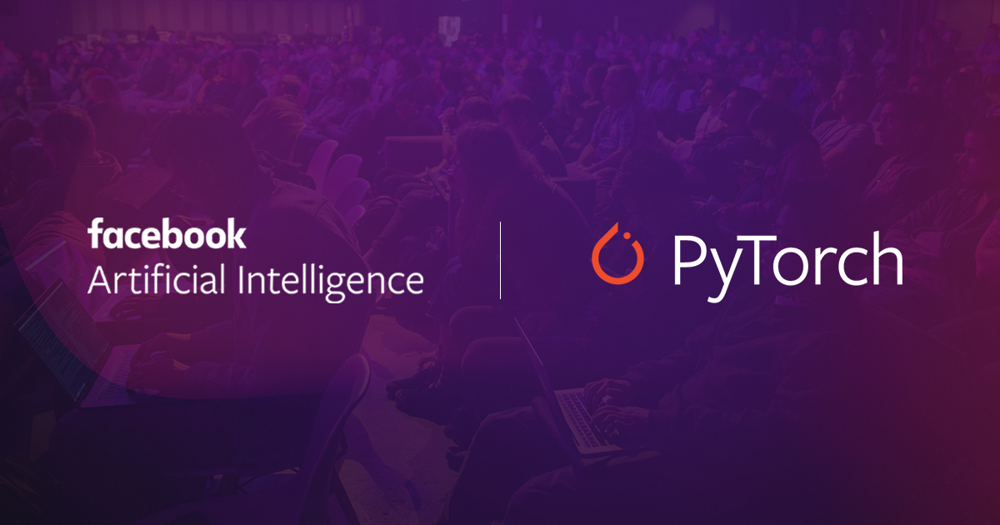

## Deep Learning with PyTorch

Here, we are covering the concepts behind deep learning and how to build deep learning models using PyTorch. 

### Includes:

- Hands-on exercises in defining and training our own state-of-the-art deep learning models.

### Why Deep learning?

> Deep learning is a field of machine learning utilizing massive neural networks, massive datasets, and accelerated computing on GPUs. Many of the advancements we've seen in AI recently are due to the power of deep learning. This revolution is impacting a wide range of industries already with applications such as personal voice assistants, medical imaging, automated vehicles, video game AI, and more.

### PyTorch

- PyTorch is an open-source Python framework from the Facebook AI Research team used for developing deep neural networks. 

- PyTorch is more like an extension of Numpy that has some convenience classes for defining neural networks and accelerated computations using GPUs. 

- PyTorch is designed with a Python-first philosophy, it follows Python conventions and idioms, and works perfectly alongside popular Python packages